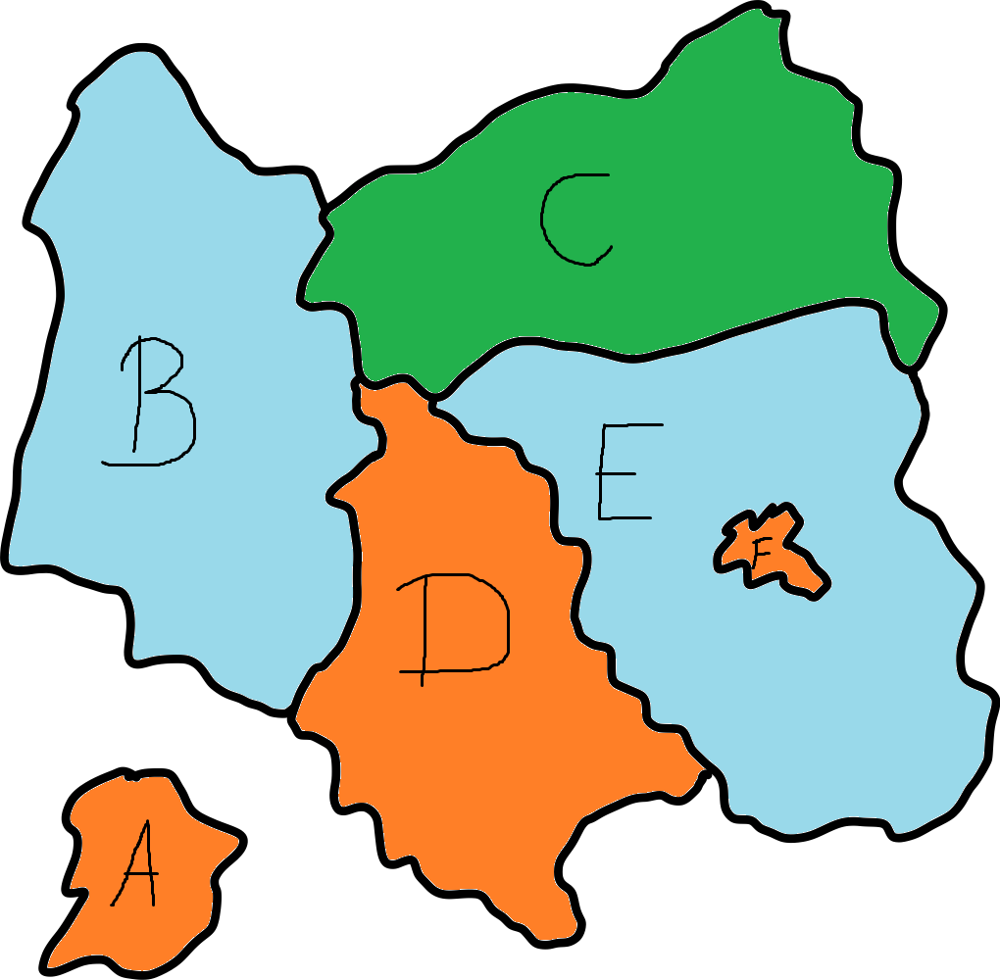
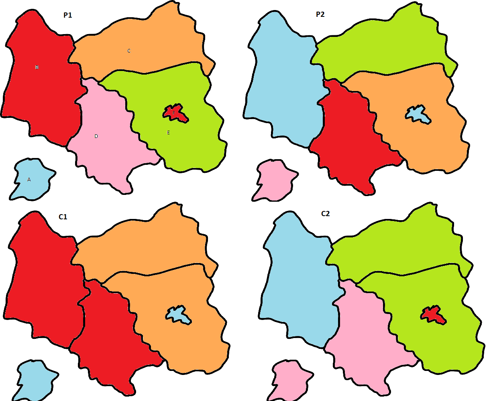
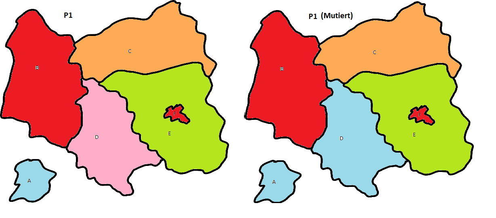
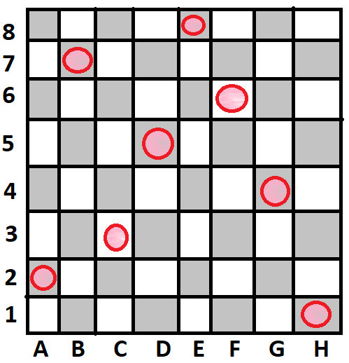

# Übungsblatt: Lokale Suche, GA

## EA.01: Modellierung von GA (2P)

 8-Queens-Problem und Landkarten-Färbeproblem

Starten beim Färbeproblem mit fünf verschiedenen Farben, Ziel: konfliktfreie Einfärbung mit minimalen Farbanzahl 

### Landkarten

#### Kodierung (Wie sieht ein "Individuum" aus?)

Regionen: [A, B, C, D, E, F]

Farben: [b, g, o, r, p]

also 

Individuum = (A:color, B:color, C:color, D:color, E:color, F:color) mit color = {r,g,b,p,o}, z.B. (b,g,o,r,p,b)

#### Operationen

##### Crossover
|||
|-|-|
|P1: (**b,r,o,p,g,r**) |P2: (p,b,g,r,o,b)|
|C1: (**b,r,o,**,r,o,b)|C2: (p,b,g**p,g,r**)|

Wäre gut geeignet, da große Änderung auf einmal Möglich sind. Mit Hilfe der Fitnessfunktion kann hier gut eingeschätzt werden, ob es in die richtige Richtung geht

##### Mutation

(P1 aus Crossover)

(b,r,o,p,g,r) -> Mutation in Region D -> (b,r,o,**b**,g,r)

Finde ich jetzt nicht so gut für unser Problem, da es "zu langsam" ist, wenn nur zufällig eine Region die farbe wechselt. Dabei ist kein Trend erkennbar, es ist nicht steuerbar und hilft uns nicht alleine zum Ziel. Es kann verwendet werden, um lokale Minima zu verlassen

#### Fitnessfunktion

Was ist schlecht? 
* benachbarte Regionen in gleicher Farbe
* zu viele Farben ( 6 wäre maximum, wir starten schon bei "nur" 5)

=> Kenngrößen:
* Konflikte = Benachbarte Regionen haben gleiche Farbe, schwerwiegend, darf nicht sein!
* Farbanzahl = soll minimal sein

Die Farbanzahl kann maximal 5 betragen. Dadurch müssen Konflikte eine höhere Wichtung bekommen, da sie nicht eintreten dürfen ( sonst 1 Konflikt besser als 2 Farben benutzt). Wir haben ein Maximum von 5 Farben, somit muss ein Konflikt mehr wert sein, als 5. Ich wähle Faktor 10

Bewertungsfunktion z.B. : 
fitness = 100 - (10*Konflikte) - Farbanzahl

Bsp: (Aus Crossover)
|Individuum|Konflikte|Farben|Fitness|
|-|-|-|-:|
|P1|0|5|95|
|P2|0|5|95|
|C1|2|3|77|
|C2|1|4|86|

### 8 Damen
8 Damen auf einem 8x8 Feld so platzieren, dass sie sich nicht gegenseitig bedrohen

#### Kodierung
1 Individuum stellt 8 Damen mit ihrer Prosition dar

x = {1,2,3,4,5,6,7,8}

y = {a,b,c,d,e,f,g,h}

Dame Dx  = ( yPosition)

Individuum = (D1: yPosition, D2: yPosition, D3: yPosition, D4: yPosition, D5: yPosition, D6: yPosition, D7: yPosition, D8: yPosition)

Somit ist auch sicher, dass die Damen nur in eine Richtung verschoben werden, also auf jeder Reihe steht eine Dame, es wird nur nach links oder rechts verschoben
#### Operationen
##### Crossover

Könnte hier eher dazu führen, dass die Konflikte erhöhen, sollte wenn dann auch in kleinerer Form verwendet werden, also nicht die Hälfte beider Eltern, sondern zB nur einen Wert der Eltrn vertauschen

##### Mutation

Langsames herantasten an eine mögliche Lösung, hier der bessere Weg, würde 2 Positionen in einem Individuum tauschen. Also wie das abgeschwächte Crossover, nur weniger overhead

#### Fitnessfunktion

Hier ist das Kriterium, dass sie sich nicht gegenseitig bedrohen dürfen. Es kann mehrere Lösungen gebenn

Fitness = 1 / 1 + Anzahl Bedrohungen

Mit einer Fitness von 1 ist damit eine Lösung gefunden

### Simulated Annealing

Wir würden außerdem benötigen:
* Abkühlungsplan
* Akzeptanzwahrscheinlichkeit, mit der schlechtere Lösungen akzeptiert werden
* Stopp-Wert (Vorlesung: Keine Verbesserungen in 3(Stop Wert) aufeinander folgenden Temperaturen) 

## EA.02: Implementierung (5P)

siehe [Implementierung](B02_GA/src/Main.java)

|Problem|Durchlauf|Mutationsrate|Crossover Rate|Turniergröße|Populationsgröße|Maximale Generationen||Erfolgsrate in %| Durchschnittliche beste Fitness| beste Fitness|
|-|-|-|-|-|-|-|-|-|-|-|
|Landkarte Färben|1|0,01|0,8|3|200|200||100|96,98|97|
||2|**0,1**|0,8|3|200|200||100|96,98|97|
||3|0,01|**0,08**|3|200|200||100|96,98|97|
||4|0,01|0,8|**10**|200|200||100|96,98|97|
||5|0,01|0,8|3|**1000**|200||100|97|97|
||6|0,01|0,8|3|200|**1000**||100|96,98|97|
||7|**0,001**|**0,1**|**2**|**20**|**20**||100|96,37|97|
||8|**0,1**|**0,9**|**10**|**1000**|**1000**||100|97|97|
|||||||||||
|8 Damen|1|0,01|0,8|3|200|200||8|0|1|
||2|**0,1**|0,8|3|200|200||6|0,06|1|
||3|0,01|**0,08**|3|200|200||2|0,02|1|
||4|0,01|0,8|**10**|200|200||3|0,03|1|
||5|0,01|0,8|3|**1000**|200||44|0,44|1|
||6|0,01|0,8|3|200|**1000**||6|0,06|1|
||7|**0,001**|**0,1**|**2**|**20**|**20**||1|0,01|1|
||8|**0,1**|**0,9**|**10**|**1000**|**1000**||73|0,73|1|

## EA.03: Anwendungen (3P)

||Fitnessfunktion|Individuen|Operatoren|
|-|-|-|-|
|[Wo ist Waldo](https://github.com/rhiever/Data-Analysis-and-Machine-Learning-Projects)|Bewertet die Such-Routengesamtlänge -> kurz = gut|Individuum = Such-Route mit 68 Koordinaten|Mutation: zwei locations im such-path tauschen, Shuffle-Mutation: nimmt eine Teilstrecke und packt sie woanders hin |
|[EvolutionSimulator](https://www.openprocessing.org/sketch/205807)|Es wird bewertet, welche individuuen am weitesten kommen. dann werden 500 eleminiert, zum großteil die schlechtesten, allerdings hängt da eine random komponente mit drin|"Creatures" bestehend aus Muskeln? (schwierig da aus dem code was sinnvoll rauszulesen)|scheint Crossover mit Mutationen zu sein, also wir haben definitiv eine Selektion (von 1000 überleben ja nur 500 und werden dann irgendwie gebreeded)|
|[“american fuzzy lop”](https://lcamtuf.coredump.cx/afl/)|bewertet code-coverage, state transitions, crash detection un dexecution time, im endeffekt kommt es drauf an, wie "interessant" ein neuer testfall ist|individuen sind testfälle|formen der mutationen (bits umdrehen, tauschen), kombination von "fitten" individuen (crossover)|

Andere Anwendungen:

Lieferlogistik/Routenplanung -> optimale Reihenfolge und Route für Lieferungen finden, Fahrzeit und Verbrauch minimieren

Produktempfehlungen und Personalisierung -> Empfehlungen an Nutzerverhalten anpassen, Optimierung mit gewichtung, "Gefällt mir" Angaben helfen bei der Fitnessbestimmung