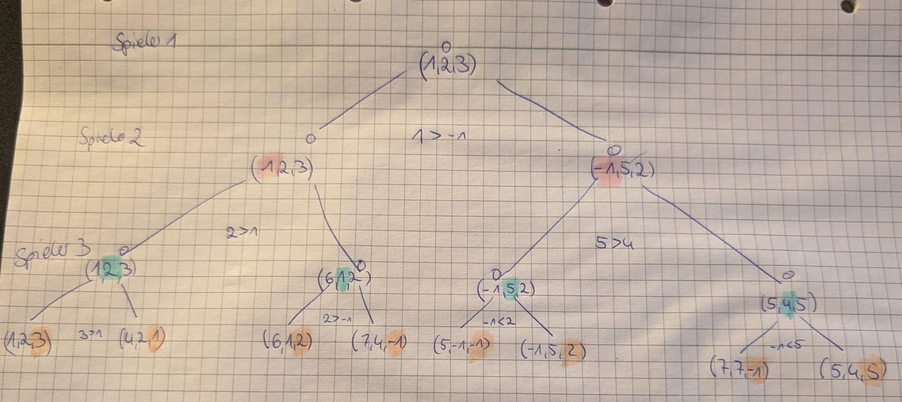

## Games.01: Handsimulation: Minimax und alpha-beta-Pruning (3P)


###  Geben Sie für den Spielbaum die Minimax-Bewertungen an 

```
MAX                 A = 3
            /         |                      \
MIN      B=3         C=2                       D=1
          |           |                           | 
MAX B:[8, 7, 3]     C:[E(9), F(2), G(6)]           D: [2, 1, 3]
                    /     |          \
MIN        E: [9, 1, 6] F: [2, 1, 1]  G: [6,5,2]

```

###  alpha-beta-Pruning

|Knoten|Kind|Berechnung|$\alpha$|$\beta$|Pruning|
|-|-|-|-|-|-
|A(MAX)|||$-\infty$|$+\infty$||
|B(MIN)|8|$\beta = min(\infty, 8) = 8$ |$-\infty$|8||
||7|$\beta = min(8, 7) = 7$ |$-\infty$|7||
||3|$\beta = min(7, 3) = 3$ |$-\infty$|3||
|A||$\alpha(A) = max(-\infty, 3) = 3$|3|$+\infty$
|C|E, F, G||3|$+\infty$|
|E(MAX)|9|$\beta = min(\infty, 9)=9$|3|9||
||1|$\beta = min(9, 1)=1$|3|1|$\alpha \ge \beta -> Ja$|
||6|-> wird abgeschnitte, ist egal||||
|F(MAX)|2|$\beta = min(\infty, 2)=2$|3|2|$\alpha \ge \beta -> Ja$|
||1,1|-> wird abgeschnitte, ist egal||||
|G(MAX)|6|$\beta = min(\infty, 6)=6$|3|6||
|G(MAX)|5|$\beta = min(6,5)=5$|3|5||
|G(MAX)|2|$\beta = min(5,2)=2$|3|2|$\alpha \ge \beta -> Ja, aber Ende isthalt auch erreicht$|
|C||$max(1,2,2) = 2$|||||
|A||$\alpha  =max(3,2) = 3$||||
|D|2|$\beta = min(\infty, 2)=2$|3|2|$\alpha \ge \beta -> Ja$|
||1,3 nicht untersucht|||

-> Pruning an E, F, G


###  (1P) Knoten anders anordnen, dass
alpha-beta-Pruning eine größere Anzahl von Zweigen abschneidet? 

Ja, in MIN Knoten könnten die Kinder aufsteigend Sortiert werden. somit istdie Bedingung $\alpha \ge \beta$ im Besten fall direkt mit dem ersten Kinderfüllt. BSP: Knoten E hat: [9, 1, 6]. es wird ) untersucht, Bedingung nichterfüllt. es wird 1 untersucht -> passt, 6 wird ausgelassen. Wenn wir nun Eso sortieren: [1, 6, 9], dann ist die Bedinung mit dem ersten Kind erfüllt.Wir suchen hier ja immer das erste $\beta \lt \alpha$. Wenn wir diese Aufsteigend untersuchen, können die anderen $\beta$ nicht kleiner sein, als das erste. Das gleiche gilt analog mit den MAX Knoten, wo absteigend sortiert werden kann


## Games.02: Optimale Spiele: Minimax und alpha-beta-Pruning (4P)

[Implementierung](TicTacToeMinimax.java)

Feld: 
```
0 | 1 | 2
3 | 4 | 5
6 | 7 | 8
```

###  (1P) Vergleichen Sie die Anzahl der jeweils berechneten Knoten.
Überlegen Sie sich dazu ein **sinnvolles** Szenario.

Anzahl Knoten:
|Pruning|MAX|MIN|Gesamt|
|-|-|-|-|
|OHNE|258264|291681|549945|
|MIT|8400|9896|18296|

-> 549945/18296 = 30,08, also Sind es ca 30 Mal mehr Knoten ohnePruning

keine Ahnung was mit Szenario gewollt ist hier 

## Games.03: Minimax vereinfachen (1P)

Nullsummenspiel = Der Sieg des einen ist des Anderens Verlust

-> utility(MAX)=-utility(MIN)... Max-Value(state) und MinValue(state) machen das gleiche, nur mit umgekehten Vorzeichen

```python
#player = vorzeichen... +1 für MAX, -1 für MIN
def minmimax(state, player):
    if Terminal(state):
        return player * Utility(state)

    best = -∞
    for each successor s of state:
        val = -minimax(s, -player)
        best = max(best, val)
    return best

```

Baum: 
```
       A-MAX
      /      \
   B(MIN)   C(MIN)
   / \       /  \
  3   5     2    9
```

A ruft minimax(A, +1) auf -> ruft minimax(B, -1) und minimax(C, -1) auf

B) player * Utility(state) = -1 * 3 = -3 (best wird auf -3 gesetzt und gemerkt) und -1 * 5 = -5,

-> best = max(best, val), also max(-3, -5) -> best = -3 wird mit geflippten Vorzeichen zurückgegeben

C) -1 * 2 = -2, -1 * 9 = -9, max(-2,-9) = -2 -> vorzeichen flippen und zurück geben

A) max(3, 2) = 3
## Games.04: Suchtiefe begrenzen (1P)

Funktion: 

$X_n$ = Anzahl Zeilen/Spalten/Diagonalen mit genau n X und kein O

$O_n$ = Anzahl Zeilen/Spalten/Diagonalen mit genau n O und kein X

Utility Regel: `+1`, falls $X_3 = 1$, `-1` falls $O_3 = 1$, sonst `0`

Für alle Nichtterminale: $Eval(s) = 3 \cdot X_2(s) + X_1(s) - (3 \cdot O_2(s) + O_1(s))$

---

Zustände:

1) Terminal: X Gewinnt
```
 X | X | X
 O | O | []
[] | []| []
``` 

$X_3 = 1$ => Utility = +1, Eval(s) = +1 für diesen Terminalzustand

2) Terminal: O Gewinnt
```
 O | O | O
 X | X | []
[] | []| []
``` 
$O_3 = 1$ => Utility = -1, Eval(s) = -1 für diesen Terminalzustand

2) Terminal: Unentschieden
```
 O | X | O
 O | O | X
 X | O | X
``` 
$O_3 = 0, X_3 = 0$ => Utility = 0, Eval(s) = 0 für diesen Terminalzustand

4) Nicht-Terminal: X liegt vorne
```
 X | X | []
[] | O | []
[] | []| []
``` 

$X_2 = 1$ -> oberste Reihe

$X_1 = 1$ -> erste Spalte

$O_2 = 0$

$O_1 = 1$ -> zweite Reihe

$Eval(s) = 3 \cdot 1 + 1 - (3 \cdot 0 + 1 = 2)$


5) Nicht-Terminal: Der nächste Zug gewinnt
```
 O | O | []
 X | []| X
[] | O | []
``` 

$X_2 = 1$ 

$X_1 = 1$ 

$O_2 = 2$

$O_1 = 1$

 $Eval(s) = 3 \cdot 1 + 1 - (3 \cdot 2 + 1) = -3$

-> aus sicht von X (aus dessen Sicht wir schauen) sieht es schlecht aus, O hat zwei Möglichkeiten zu gewinnen

6) Nicht-Terminal: mit Diagonale
```
 X | O | X
 O | X | []
[] | []| O
``` 

$X_2 = 1$ 

$X_1 = 0$

$O_2 = 0$

$O_1 = 1$ 

$Eval(s) = 3 \cdot 1 + 0 - (3 \cdot 0 + 1 = 2) = 2$


Warum die Sinnvoll?
Evaluiert, wie viele "nicht-durch-den-Gegner-blockierte" Zeilen/Spalten/Diagonalen existieren, also auf wie vielen noch ein Sieg passieren kann. Zeilen/Spalten/Diagonalen, in denen bereits 2 gleiche Zeichen sind, sind höher bewertet, da diese im nächsten Zug ein Sieg sein könnten


## Games.05: Minimax generalisiert (1P)

Spielbaum eines Drei-Personen-Spiels, das nicht notwendigerweise die Nullsummenbedingung erfüllt.

```
Spieler 1                               O
                            /                       \
Spieler 2                 o                           o
                    /           \                 /       \
Spieler 3           o           o               o           o
                /    \        /    \           /     \               /\
Spieler 1   (1,2,3)(4,2,1)||(6,1,2)(7,4,-1)||(5,-1,-1)(-1,5,2)||(7,7,-1)(5,4,5)
```


 Bewertungsfunktion liefert Tripel $`(x_1, x_2, x_3)`$, $`x_i`$ ist Wert für Spieler $`i`$  Allianzen sind nicht erlaubt.


Vervollständigen Sie den Spielbaum, indem Sie alle inneren Knoten und
den Wurzelknoten mit den entsprechenden Wert-Tripeln annotieren.


