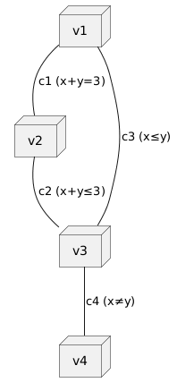

# Übungsblatt: Constraints

## CSP.01: Logikrätsel (2P)

### Variablen 
{H1, H2, H3, H4, H5} (Häuser i), jedes Hi {Farbe, Land, Getränk, Zigarettenmarke, Tier}

### Wertebereiche
Farbe = {rot, blau, grün, gelb, weiß}

Land = {norwegen, spanien, england, ukraine, japan}

Tier = {pferd, fuchs, schnecke, zebra, hund}

Getränk = {tee, wasser, milch, kaffee, osaft}

Zigarettenmarke = {old gold, kools, chesterfield, lucky strike, parliaments}


### Constraints
#### Unär (Eine Variable - ein i)
|||
|-|-|
|Milch im 3. Haus (Mittleres) | H3(Getränk) = Milch|
|Norweger im 1. Haus  | H1(Land) = Norwegen|

#### Binär (zwei Variablen - ein i)
|||
|-|-|
|Engländer im roten Haus| Hi(Land) = England <=> Hi(Farbe) = rot |
|Spanier hat Hund | Hi(Land) = Spanien <=> Hi(Tier) = Hund |
|Kaffee im günen Haus | Hi(Getränk) = Kaffee <=> Hi(Farbe) = grün  |
|Ukraine trinkt Tee | Hi(Land) = Ukraine <=> Hi(Getränk) = Tee |
|Old Gold Zigaretten hat Schnecken | Hi(Zigarettenmarke) = Old Gold <=> Hi(Tier) = Schnecken |
|Kools wohnt im gelben Haus |Hi(Zigarettenmarke) = Kools <=> Hi(Farbe) = gelb |
|Lucky Strike trinkt Osaft | Hi(Zigaretten) = Lucky Strike <=> Hi(Getränk) = Osaft |
|Japaner raucht Parliaments | Hi(Land) = Japan <=> Hi(Zigaretten) = Parliaments |

#### Positionsabhängigkeiten
|||
|-|-|
|Chesterfield wohnt neben Fuchs| \|i(Hi(Zigaretten = Chesterfield))-i(Hi(Tier = Fuchs))\| = 1|
|Kools wohnt neben Pferd |\|i(Hi(Zigaretten = Kools))-i(Hi(Tier = Pferd))\| = 1|
|Norweger wohnt neben blau |\|i(Hi(Land = Norwegen))-i(Hi(Farbe = blau))\| = 1|
|grün wohnt rechts von weiß |i(Hi(Farbe = grün))-i(Hi(Farbe = weiß)) = 1|


## CSP.02: Framework für Constraint Satisfaction (3P)

Lösen Sie nun das obige Rätsel (aus CSP.01):

### BT Search

[BT Search](bt.pdf)

### BT Search mit MRV und Gradheuristik

[Mit Heuristik](bt_heuristik.pdf)

MRV = Wähle Variablemit wenigsten möglichen Werten

Gradheuristik = Bei gleich vielen möglichen Werten nimm die, diemehr Constrains zu noch unzugewiesenen Werten hat

```python
def BT_Search(assignment, csp):
    if complete(assignment, csp): return assignment

    var = SELECT_UNASSIGNED_VARIABLE(csp, assignment)  

    for value in ORDER_VALUES(csp, var, assignment):    
        if consistent(value, var, assignment, csp):
            assignment += {var = value}

            if INFERENCE(csp, assignment, var) != failure:
                result = BT_Search(assignment, csp)
                if result != failure: return result

            assignment -= {var = value}

    return failure

```

--- 

```python
def SELECT_UNASSIGNED_VARIABLE(csp, assignment):
    candidates = [v for v in csp.variables if v not in assignment]

    # MRV
    min_domain_size = +infty
    mrv_vars = []
    for v in candidates:
        domain_size = SIZE_OF_CURRENT_DOMAIN(csp, v)  
        if domain_size < min_domain_size:
            min_domain_size = domain_size
            mrv_vars = [v]
        elif domain_size == min_domain_size:
            mrv_vars.append(v)

    if len(mrv_vars) == 1: #nur eine mögliche Variable
        return mrv_vars[0]

    # Gradheuristik
    best = None
    best_degree = -1
    for v in mrv_vars:
        degree = COUNT_CONSTRAINTS_TO_UNASSIGNED_VARS(csp, v, assignment)
        if degree > best_degree:
            best_degree = degree
            best = v

    return best

```

#### Ergebnisse

BT:
|Haus|Farbe|Tier|Land|Getränk|Zigaretten|
|-|-|-|-|-|-|
|1|gelb|Fuchs|Norwegen|Wasser|Kools|
|2|blau|Pferd|Ukraine|Tee|Chesterfield|
|3|rot|Schnecken|England|Milch|Old Gold|
|4|weiß|Hund|Spanien|OSaft|Lucky Strike|
|5|grün|Zebra|Japan|Kaffee|Parliament|

BT mit Heuristik:
|Haus|Farbe|Tier|Land|Getränk|Zigaretten|
|-|-|-|-|-|-|
|1|gelb|**Zebra**|Norwegen|Wasser|Kools|
|2|blau|Pferd|**Japan**|**Milch**|**Parliaments**|
|3|**weiß**|Schnecken|**Ukraine**|**Tee**|Old Gold|
|4|**grün**|Hund|Spanien|**Kaffee**|**Chesterfield**|
|5|**rot**|**Fuchs**|**England**|**OSaft**|**Lucky Strikes**|

Ich glaub ich hab das mit der Heuristik irgendwie verhauen.. Ja, direkt bei Milch im 3. Haus hab ich mich wohl in der Zeile vertan beim Eintragen... 

beide haben eine Laufzeit von $O(d^n)$ mit d=größe Wertebereich, n=Anzahl Variablen
Mit Heuristik ist aber doch spürbar schneller gewesen, da sich mehr einfach so ergeben hat, dadurch, dass die Möglichkeiten schnell eingeschränkt wurden

### AC-3
* Nur mit binären Constraints zwischen zwei Variablen

|||
|-|-|
|Chesterfield wohnt neben Fuchs| \|i(Hi(Zigaretten = Chesterfield))-i(Hi(Tier = Fuchs))\| = 1|
|Kools wohnt neben Pferd |\|i(Hi(Zigaretten = Kools))-i(Hi(Tier = Pferd))\| = 1|
|Norweger wohnt neben blau |\|i(Hi(Land = Norwegen))-i(Hi(Farbe = blau))\| = 1|
|grün wohnt rechts von weiß |i(Hi(Farbe = grün))-i(Hi(Farbe = weiß)) = 1|

Wir haben also nur Nachbarschafts Constraints, wobei nur bei grün rechts von weiß eine Richtung gegeben ist. 

Dom(Weiß): {1,2,3,4} => keine 5, da dann kein grün rechts daneben (nur 5 häuser) Dom(Grün): {2,3,4,5} => kein 1, weil dann kein weiß links daneben (es gibt kein Haus 0)

Damit haben wir die minimale Einschränkng, dass für Haus 1 kein grün und für Haus 5 kein weiß geprüft werden muss, Das reduziert die Domäne für Weiß und Grün, was dazu führen könnte, dass MRV diese früher in betracht zieht. Ich werde das jetzt aber nicht alles noch mal aufschreiben...

### Min-Conflicts

* Zufällige Startkonstellation, danach beseitigen von Konflikten 
* Kommt auch zum Ziel, kann schnell sein, da bei einer zufälligen startkonstellatiuon schon Werte konfliktfrei sein können


## CSP.03: Kantenkonsistenz mit AC-3 (1P)

Sei $`D=\lbrace 0, \ldots, 5 \rbrace`$, und ein Constraintproblem
definiert durch

``` math
\langle
    \lbrace v_1, v_2, v_3, v_4 \rbrace,
    \lbrace D_{v_1} = D_{v_2} = D_{v_3} = D_{v_4} = D \rbrace,
    \lbrace c_1, c_2, c_3, c_4 \rbrace
\rangle
```

mit

- $`c_1=\left((v_1,v_2), \lbrace (x,y) \in D^2 | x+y = 3 \rbrace\right)`$,
- $`c_2=\left((v_2,v_3), \lbrace (x,y) \in D^2 | x+y \le 3 \rbrace\right)`$,
- $`c_3=\left((v_1,v_3), \lbrace (x,y) \in D^2 | x \le y \rbrace\right)`$
  und
- $`c_4=\left((v_3,v_4), \lbrace (x,y) \in D^2 | x \ne y \rbrace\right)`$.

|Constraint|Variable|Bedingung|
|-|-|-|
|c1|v1,v2|x+y = 3|
|c2|v2,v3|x+y <= 3|
|c3|v1,v3|x <= y|
|c4|v3,v4|x != y|



[AC-3](AC3.pdf)
## CSP.04: Forward Checking und Kantenkonsistenz (1P)

[Kantenkonsistenz, Forward Checking](aufgabe4.pdf)


## CSP.05: Planung von Indoor-Spielplätzen (3P)

* 400 x 1000 Felder
* Spielgeräte, Elemente:
* * Go Kart Bahn 
* * Hüpfburg 
* *  Kletterberg 
* * Bar 
* Ziel/Constraints:
* * Keine Überlappung - Abstand 10 Felder -> Bei der Planung in alle Richtungen 5 Felder ergänzen, macht es einfacher zu planen
* * Bar am Eingang
* * Notausgänge (Wände) frei
* * Kletterberg nähe Bar
* * Entspannungszonen zwischen Geräten

PG = Position GoKart, PH = Position Hüpfburg, PK = Position Kletterberg, PB = Position Bar

V= {PG, PH, PK, PB}
Domänen = Alle Rasterpositionen, auf denen das jeweilige Gerät/Element vollständig im Feld ist

C = {(Bar am Eingang), (Abstand zu Wänden), (Keine Elemente zwischen Kletterberg und Bar -> Kletterberg direkter Nachbar von Bar), (Entspannungszonen zwischen Geräten))}

#### MAC
* Systematische zuweisung von Elementen, jede Position prüft die Constrains
* durch Kantenkonsistenz wird nach Platzieren direkt die Domäne der verbleibenden reduziert

#### Min Conflicts
* Zufällige Startplatzierung, Iterative Verbesserung

Ich werde das nicht weiter lösen, da die Aufgabe zu schwammig ist. Ich habe Keine größen für die Geräte, könnte somit einfach minimal kleine 2x2 geräte nehmen und die aufgabe findet gaaaaanz schnell eine Lösung. Außerdem sind es sehr viele Positionen/Koordinaten, die man durchgehen müsste.